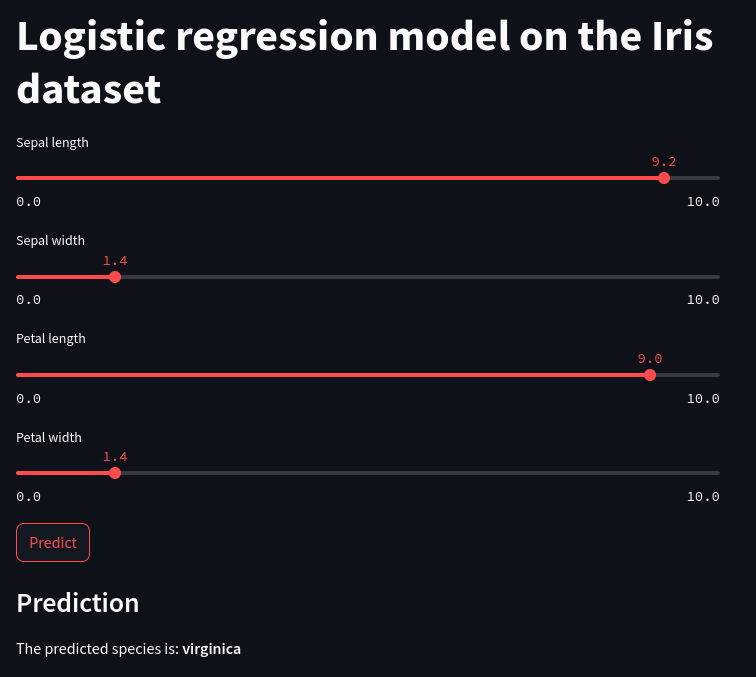

[](README.ru.md)
[](https://www.python.org/)
[](https://github.com/italian/simple_automatic_machine_learning_pipeline/blob/main/LICENSE)

# A simple automated machine learning system

This is an implementation of a simple automated machine learning system using [Docker](https://www.docker.com) and [Streamlit](https://streamlit.io) to deploy a logistic regression model on the Iris dataset.

## How to get started

1. Clone the repository.
2. Go to the project directory:
    ```shell
    cd simple_automatic_machine_learning_pipeline/lab3
    ```
3. Run Docker Compose:
    ```shell
    docker-compose up
    ```
4. Open `http://localhost:8501` in your browser to access the Streamlit application.

## How to use

The Streamlit app allows you to enter parameters to predict Iris species.

Use the sliders to enter the length and width of the sepal and petal, and then click "Predict" to get the model prediction.



## Лицензия

This project is distributed under the MIT licence.