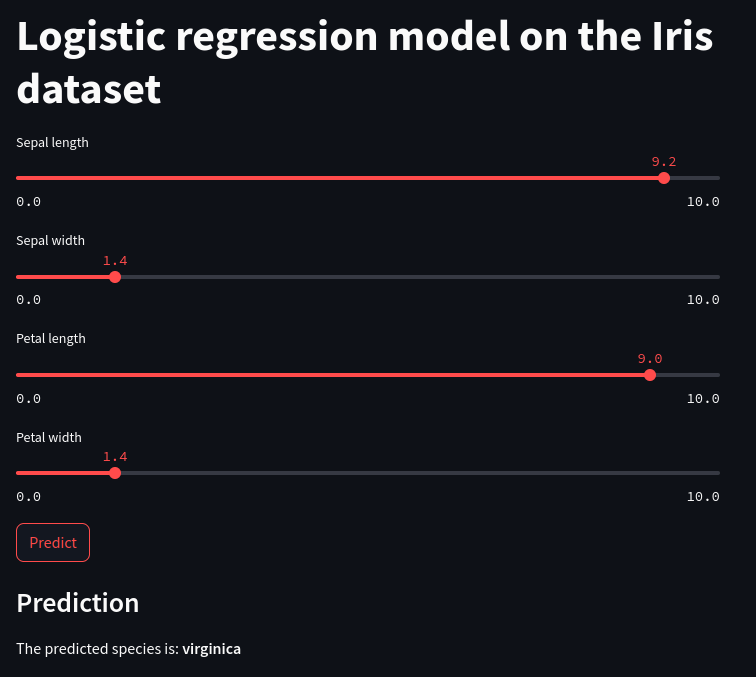

[](README.md)
[](https://www.python.org/)
[](https://github.com/italian/simple_automatic_machine_learning_pipeline/blob/main/LICENSE)

# Простая автоматизированная система машинного обучения

Это реализация простой автоматизированной системы машинного обучения, использующей [Docker](https://www.docker.com) и [Streamlit](https://streamlit.io) для развертывания модели логистической регрессии на датасете Iris.

## Как работает

Процесс работы включает в себя следующие этапы.

### 1. Обучение модели

На основе датасета Iris, используя библиотеку `sklearn`, создается модель логистической регрессии.

Этот процесс включает:
- загрузку датасета,
- разделение его на тренировочный и тестовый наборы,
- нормализацию,
- обучение модели на тренировочном наборе,
- сохранение обученной модели и преобразователя (scaler) для последующего использования.

### 2. Контейнеризация с Docker

Для каждой части приложения (модель и веб-интерфейс) создается отдельный `Dockerfile`, который определяет, как создать `Docker-образ` для каждой части.

Это включает в себя установку всех необходимых зависимостей и копирование кода приложения в образ.

`Docker Compose` используется для управления запуском и взаимодействием между контейнерами модели и веб-интерфейса.

### 3. Веб-интерфейс со Streamlit

`Streamlit` используется для создания интерактивного веб-интерфейса, который позволяет пользователям вводить параметры для предсказания вида ириса.

Пользователь может использовать слайдеры для ввода длины и ширины чашелистика и лепестка, а затем нажать кнопку "Predict" для получения предсказания от модели.

### 4. Интеграция модели и веб-интерфейса

Модель и веб-интерфейс работают вместе, позволяя пользователям вводить данные через веб-интерфейс и получать предсказания от модели.

Вектор входных данных, полученный от пользователя, нормализуется с использованием сохраненного преобразователя (scaler), и затем передается в модель для получения предсказания.

Предсказание затем отображается пользователю в веб-интерфейсе.

### 5. Развертывание и управление

Использование `Docker` и `Docker Compose` облегчает развертывание и управление приложением.

`Docker Compose` позволяет легко запускать и управлять несколькими контейнерами как единой системой, обеспечивая единообразие и изоляцию между различными частями приложения. Это упрощает процесс развертывания и обновления приложения, а также обеспечивает легкость масштабирования и управления версиями.

## Как начать

1. Клонируйте репозиторий.
2. Перейдите в директорию проекта:
    ```shell
    cd simple_automatic_machine_learning_pipeline/lab3
    ```
3. Запустите Docker Compose:
    ```shell
    docker-compose up
    ```
4. Откройте в браузере `http://localhost:8501` для доступа к приложению Streamlit.

## Как использовать

Приложение Streamlit позволяет вводить параметры для предсказания вида ириса.

Используйте слайдеры для ввода длины и ширины чашелистика и лепестка, а затем нажмите кнопку "Predict" для получения предсказания модели.



## Лицензия

Этот проект распространяется под лицензией MIT.